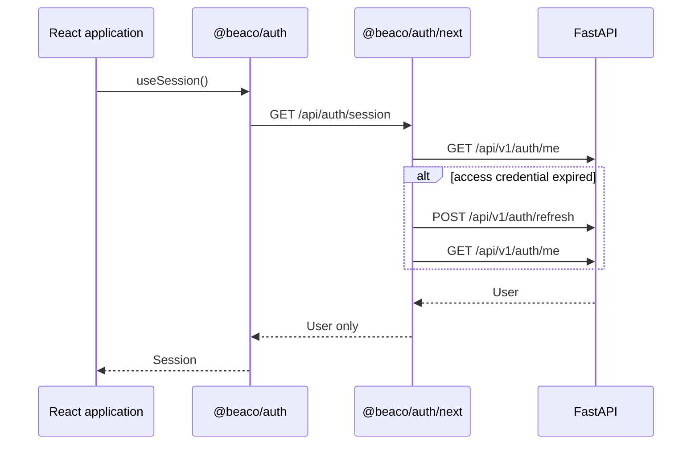
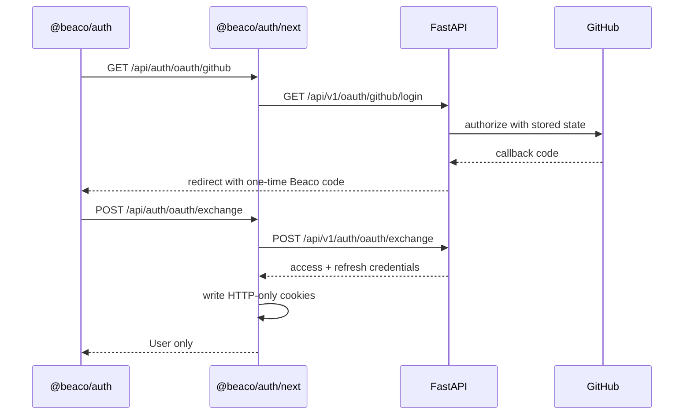

# `@beaco/auth`

Beaco's framework-neutral authentication SDK. Applications use this package to create and
observe a human **Session** without reading or persisting access and refresh tokens.

## Package layers

- `@beaco/auth` — typed client, domain models, structured errors, and client seam
- `@beaco/auth/react` — TanStack Query provider, session query, and mutation hooks
- `@beaco/auth/next` — reusable Next.js route handlers and HTTP-only cookie custody

The browser client talks only to the consuming application's `appAuthPath`. The Next adapter
maps those requests to FastAPI and keeps token values on the server. The `AuthClient` interface
remains injectable, so native or desktop applications can provide an adapter backed by
Keychain, Keystore, or another platform security facility.

```mermaid
flowchart LR
  App[React application] --> ReactSDK[@beaco/auth/react]
  ReactSDK --> Core[@beaco/auth]
  Core --> AppRoutes[Next /api/auth routes]
  AppRoutes --> NextAdapter[@beaco/auth/next]
  NextAdapter --> Cookies[HTTP-only cookies]
  NextAdapter --> Backend[FastAPI /api/v1]
```

## Browser security model

The browser client deliberately receives `User | null`, never token values. The consuming
application's server stores the short-lived access token and refresh token in `Secure`,
`HttpOnly`, `SameSite=Lax` cookies. This keeps session credentials outside JavaScript and avoids
the XSS exposure of `localStorage` and `sessionStorage`.

The backend OAuth callback redirects with a 60-second, single-use authorization code. The
application server exchanges that code for tokens and writes the cookies. Access and refresh
tokens are never placed in the browser URL.

## React application

```tsx
import { AuthProvider } from "@beaco/auth/react";

export function Providers({ children }: { children: React.ReactNode }) {
  return <AuthProvider>{children}</AuthProvider>;
}
```

```tsx
import { useSendMagicLink, useSession } from "@beaco/auth/react";

function SignIn() {
  const session = useSession();
  const sendMagicLink = useSendMagicLink();

  // session.status is loading, authenticated, anonymous, or error.
  // sendMagicLink.mutate({ email: "person@example.com" })
  return null;
}
```

## Imperative application

```ts
import { createAuthClient } from "@beaco/auth";

const auth = createAuthClient({ appAuthPath: "/api/auth" });
const user = await auth.getCurrentUser();
```

## Next.js application adapter

Configure the adapter once in a server-only module. `backendApiUrl` is reachable by the Next.js
server; `publicBackendApiUrl` is reachable by the browser for provider redirects.

```ts
import "server-only";
import { createNextAuthAdapter } from "@beaco/auth/next";

export const beacoAuth = createNextAuthAdapter({
  appAuthPath: "/api/auth",
  backendApiUrl: "http://api:8000/api/v1",
  publicBackendApiUrl: "https://api.example.com/api/v1",
});
```

Next.js still requires filesystem route files, but each route only exposes one adapter handler:

```ts
// app/api/auth/session/route.ts
import { beacoAuth } from "@/lib/auth/next";
export const GET = beacoAuth.session;
```

```ts
// app/api/auth/oauth/github/route.ts
import { beacoAuth } from "@/lib/auth/next";
export const GET = beacoAuth.startOAuth("github");
```

The Session route is intentionally application-facing. It is not a FastAPI `/session` endpoint:



GitHub sign-in uses an application route first, then the real backend `/login` route:



## HTTP adapter contract

The default client expects the consuming application to expose:

- `POST /magic-link/request` → `{ message }`
- `POST /magic-link/verify` → `User`
- `GET /oauth/:provider` → provider redirect
- `POST /oauth/exchange` → `User`
- `GET /session` → `User` or `401`
- `POST /logout` → success response

The application auth path defaults to `/api/auth`. Set the same `appAuthPath` on
`createAuthClient` and `createNextAuthAdapter` when an application uses a different route
prefix.
